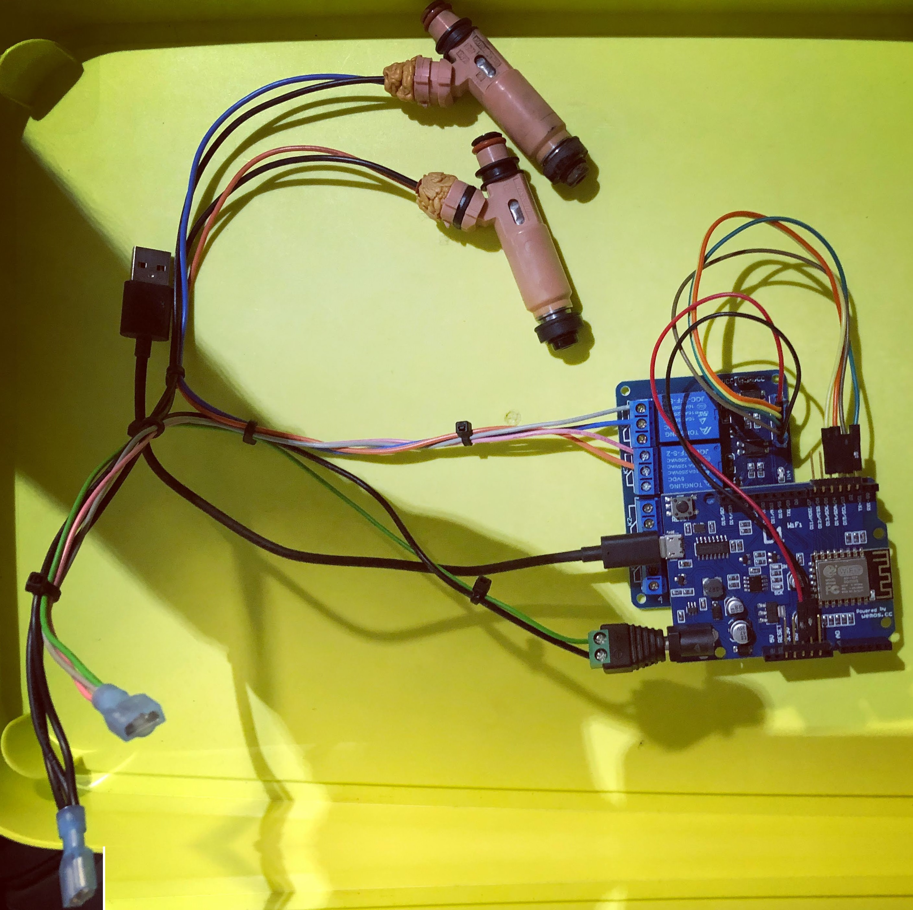
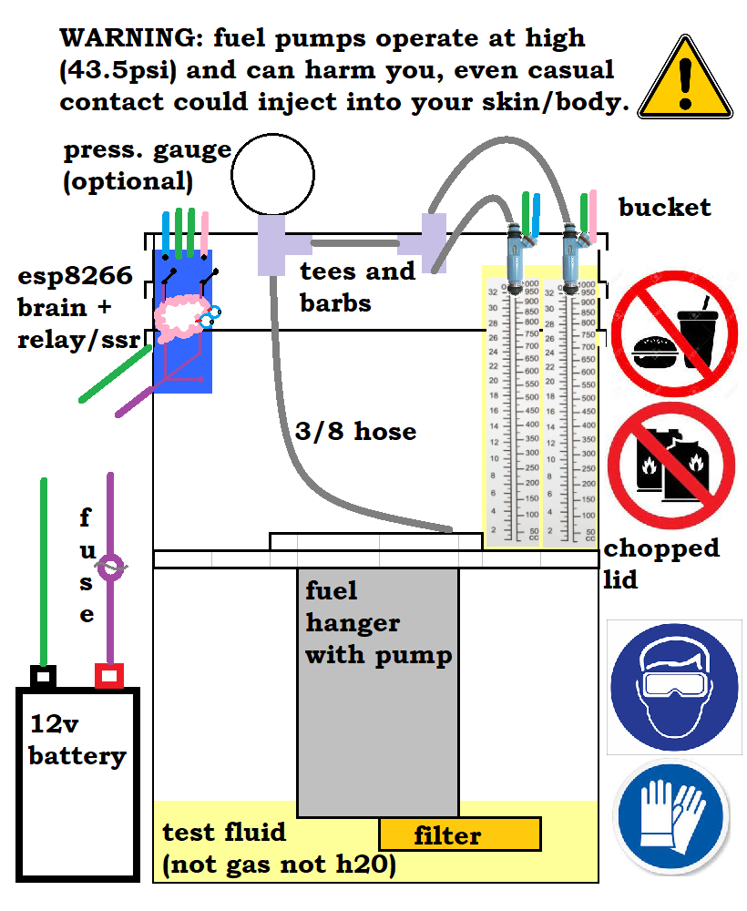

# injectorER
Injector test bed with basic/pseudo pwm duty cycle algo to test flow and flow rate of injectors (because turbo)

Had a bad experience with a set of upgraded injectors so NOTHING is going in my motor without full testing.
(those passed a "quick test", but had drizzle at moderate/high speeds, which is not safe for a turbo -- or your cats)

IF you have OCD && trust issues, you can build this too! (Code not warrantied for fitness or any specific use).
